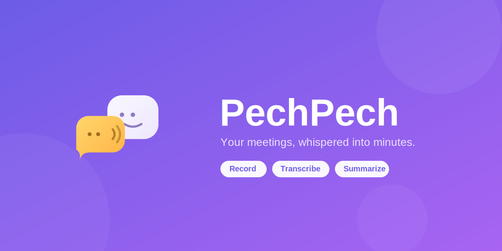

<p align="center">
  
</p>

# PechPech — Meeting MOM Generator

Automatically generate Persian **Minutes of Meeting** from browser-based calls (Google Meet, Zoom web, Teams web, or any browser tab with audio).

Click **Start** when your meeting begins, click **Stop** when it ends. You get a structured MOM — خلاصه, تصمیمات, اقدامات — ready to save as a Markdown file.

---

## How It Works

```
Chrome Extension  →  Backend Server  →  Whisper STT  →  LLM  →  MOM
(captures audio)     (orchestrates)     (transcript)   (writes)
```

- **Chrome extension** captures tab audio + your microphone, mixes them, and sends the recording to the backend server. On first install it opens a setup wizard.
- **Backend server** (a small Node.js process on your machine) pre-processes audio with ffmpeg, sends it to a Whisper-compatible STT service, then calls your LLM to produce the MOM.
- **All settings** (STT URL, API keys, LLM type) live in `server/src/config.json` and are managed through the extension's settings page — no manual file editing needed.
- Everything stays on your machine — no shared backend, no cloud accounts needed beyond what you already use.

---

## Requirements

| Requirement | Notes |
|---|---|
| Chrome / Chromium | For the extension |
| A Whisper-compatible STT server | Local (recommended) or cloud API |
| An LLM — Claude Code, a custom API, or any CLI | See LLM Setup below |
| **Native mode** | macOS or Linux · Node.js 18+ |
| **Docker mode** | macOS, Linux, or Windows · Docker Desktop |

---

## Installation

### Quick setup (recommended)

```bash
bash install.sh
```

The installer guides you through everything — port, LLM choice, STT config — and launches PechPech automatically when done. On subsequent runs:

```bash
node launcher/index.js
```

### Manual setup — Docker

#### Step 1 — Create `.env`

```env
MODE=docker
LLM_CLI=claude        # claude | api | custom
PECHPECH_PORT=3456
CLAUDE_DIR=/Users/your-username/.claude   # only needed for Claude
```

#### Step 2 — Build and start

```bash
docker compose build
docker compose up -d
```

#### Step 3 — Authenticate Claude (if using Claude)

```bash
docker exec -it pechpech-helper claude login
```

#### Step 4 — Verify

```bash
curl http://localhost:3456/health
# → {"status":"ok"}
```

#### Step 5 — Load the extension and configure

1. Open Chrome → `chrome://extensions`
2. Enable **Developer mode** → **Load unpacked** → select `extension/`
3. The PechPech onboarding page opens automatically
4. Click ⚙ in the popup to open Settings and fill in your STT URL and LLM details

---

## Running PechPech

```bash
node launcher/index.js           # start
node launcher/index.js --stop    # stop
node launcher/index.js --status  # check if server is reachable
node launcher/index.js --install # auto-start on login
```

---

## STT Setup (Whisper)

Configure the STT endpoint in the extension's **Settings** page (⚙ icon in the popup).

### Option A — whisper.cpp local server (recommended)

```bash
brew install whisper-cpp
whisper-cpp --download-model medium
whisper-server --model ~/.cache/whisper/ggml-medium.bin --host 127.0.0.1 --port 8080
```

Settings → **STT Base URL:** `http://localhost:8080/v1` · **STT API Key:** *(blank)*

### Option B — OpenAI Whisper API

Settings → **STT Base URL:** `https://api.openai.com/v1` · **STT API Key:** your key

### Option C — Groq (free tier, very fast)

Settings → **STT Base URL:** `https://api.groq.com/openai/v1` · **STT API Key:** your key

---

## LLM Setup

Three options — choose one during `install.sh` or change it anytime in Settings.

### Claude Code (recommended — uses your existing subscription)

```bash
npm install -g @anthropic-ai/claude-code
claude login
claude -p "hello"   # verify
```

In **Settings**, set LLM type to **Claude Code**.

### Custom API (any OpenAI-compatible endpoint)

Works with OpenAI, Groq, local Ollama with an OpenAI wrapper, or any service that implements `/chat/completions`.

In **Settings**, set LLM type to **Custom API** and fill in:
- **API Base URL** — e.g. `https://api.openai.com/v1`
- **API Key** — your key
- **Model** — e.g. `gpt-4o`, `llama3.1`, `claude-3-5-sonnet-20241022`

### Custom CLI

Any CLI tool that reads a prompt and writes the response to stdout.

In **Settings**, set LLM type to **Custom CLI** and enter the command, e.g.:

```
ollama run llama3.1
```

---

## Extension Settings

Click the PechPech icon → ⚙:

| Setting | Default | Description |
|---|---|---|
| STT Base URL | `http://localhost:8080/v1` | Whisper server address |
| STT API Key | *(blank)* | Leave blank for local servers |
| STT Model | `whisper-1` | Model name sent to the STT endpoint |
| LLM Type | `claude` | `claude` / `api` / `custom` |
| API Base URL | *(blank)* | Only shown for `api` type |
| API Key | *(blank)* | Only shown for `api` type |
| Model | *(blank)* | Only shown for `api` type; default `gpt-4o` |
| Custom Command | *(blank)* | Only shown for `custom` type |
| Helper Port | `3456` | Must match `PECHPECH_PORT` in `.env` |

Settings are saved to `server/src/config.json` via the server API and take effect immediately on the next recording.

---

## Usage

1. **Open your meeting** in a browser tab (Google Meet, Zoom web, Teams, etc.)
2. **Click the PechPech icon** in the Chrome toolbar
3. **Click Start Recording** — captures tab audio and microphone
4. **Have your meeting** — nothing else to do
5. **Click Stop and Save** when the meeting ends
6. Click **پردازش** on the recording card
7. Wait ~30–60 seconds for transcription and MOM generation
8. **Your MOM appears** in Persian — خلاصه, تصمیمات, اقدامات
9. Optionally click **اصلاح رونوشت** to have the LLM clean up the transcript
10. Click **ذخیره .md** to download

---

## Project Structure

```
PechPech/
├── server/                     — Backend server (Docker build context)
│   ├── Dockerfile
│   ├── .dockerignore
│   ├── package.json
│   └── src/                    — Source code only
│       ├── server.js           — Express HTTP layer
│       ├── pipeline.js         — Recording Pipeline: clean → STT → LLM → parse
│       ├── llm-providers.js    — LLM provider seam (CLIAdapter + APIAdapter)
│       ├── prompts.yaml        — LLM prompt templates (edit to customise MOM format)
│       ├── config.json         — Runtime config (gitignored, written by install.sh)
│       └── config.example.json — Config shape reference
├── extension/
│   ├── manifest.json
│   ├── background.js           — Service worker + onboarding trigger
│   ├── offscreen.html/js       — Audio capture and mixing
│   ├── popup.html/css/js       — Main recording UI
│   ├── settings.html/js        — Settings page
│   ├── onboarding.html/js      — 5-step setup wizard
│   └── icons/
├── launcher/
│   ├── index.js                — Start, stop, status, auto-start
│   └── onboarding/
│       └── index.html          — First-run guide (opened by launcher)
├── data/                       — Recordings (gitignored)
├── docker-compose.yml
├── install.sh
├── .env                        — Gitignored; written by install.sh
└── .gitignore
```

---

## Configuration

### config.json

`server/src/config.json` holds all STT and LLM settings. It is written by `install.sh` and updated through the extension's Settings page. You can also edit it manually:

```json
{
  "sttUrl": "http://localhost:8080/v1",
  "sttKey": "",
  "sttModel": "whisper-1",
  "llmCli": "claude",
  "llmCommand": "",
  "llmApiUrl": "",
  "llmApiKey": "",
  "llmApiModel": ""
}
```

### .env

Infrastructure-only — controls how the launcher starts the server:

```
MODE=native          # or: docker
PECHPECH_PORT=3456
LLM_CLI=claude       # baked into Docker image at build time
CLAUDE_DIR=~/.claude # Docker volume mount for Claude credentials
```

STT/LLM credentials do **not** go in `.env` — they go in `config.json`.

---

## Customising the MOM Format

Edit `server/src/prompts.yaml` to change what the LLM produces. The three section headings (`## خلاصه`, `## تصمیمات`, `## اقدامات`) are parsed by the server — keep them exactly as written or update the regex in `pipeline.js` too.

---

## Troubleshooting

**"Local Helper is not running" when clicking Start**

```bash
node launcher/index.js
# or: docker compose up -d
```

---

**"STT endpoint unreachable"**

```bash
curl http://localhost:8080/v1/audio/transcriptions
# Should return 405, not connection refused
```

Check the STT Base URL in Settings.

---

**"CLI not found: claude"**

```bash
which claude    # confirm it's on PATH
claude -p "hi"  # test it works
```

If `which claude` works in your shell but not from the server, enter the full path in Settings → Custom Command (e.g. `/usr/local/bin/claude`).

---

**"CLI authentication failed"**

```bash
claude login
# Docker:
docker exec -it pechpech-helper claude login
```

---

**MOM sections are empty or garbled**

- The transcript may be too short or silent — check the audio playback in the recordings list.
- The LLM output format may differ — check the server logs and edit `prompts.yaml` if needed.

---

**Audio stops when switching tabs**

Tab audio is tied to the tab active when you clicked Start. Keep the meeting tab focused or move it to a separate window.

---

## Privacy

- All audio is processed locally or sent only to the STT/LLM providers **you** configure.
- No audio, transcripts, or MOMs are ever sent to any server operated by this project.
- API keys are stored in `config.json` on your machine — they never leave it.
- The backend server only binds to `127.0.0.1` — unreachable from outside your machine.
