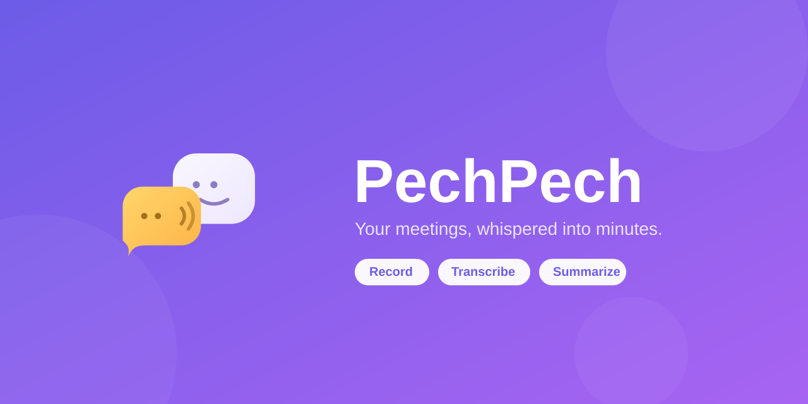
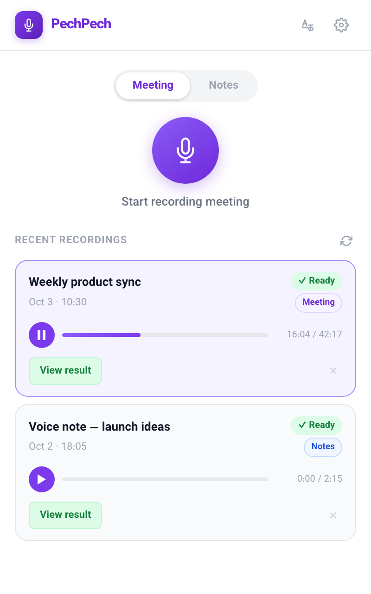
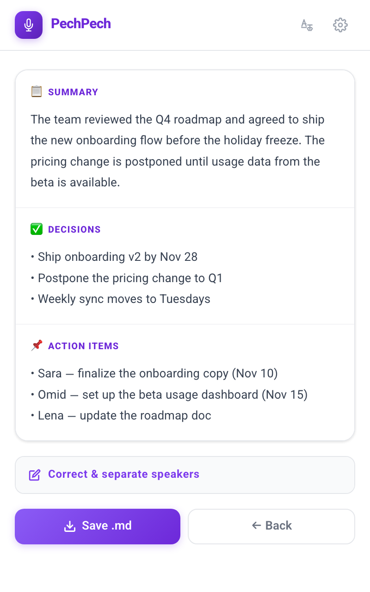
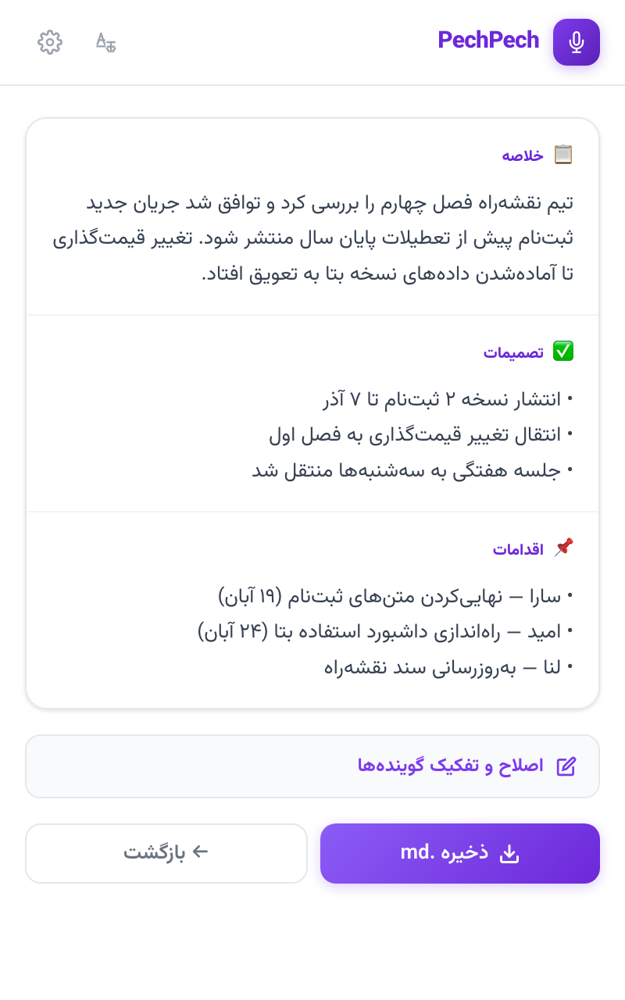
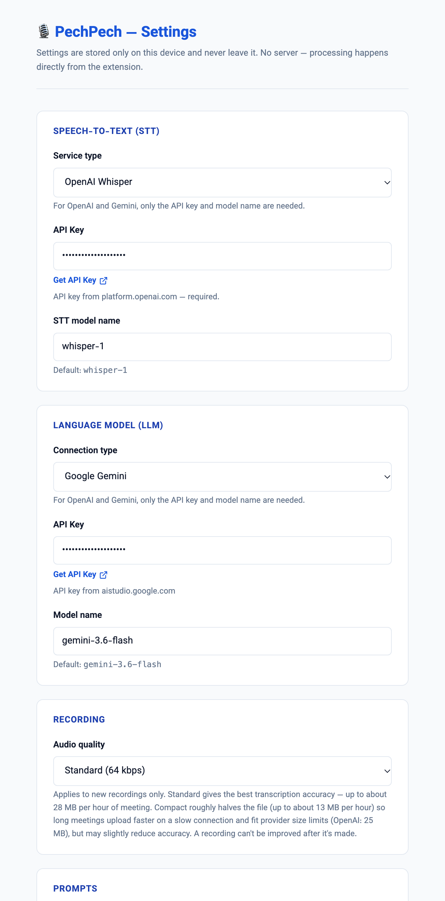
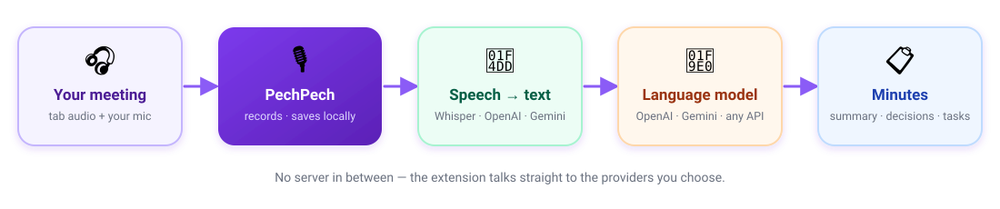

<p align="center">
  
</p>

<h3 align="center">Record a meeting. Get the minutes.</h3>

<p align="center">
  A Chrome extension that turns browser-based calls into clean <b>Minutes of Meeting</b> —
  in English or فارسی. No server, no accounts: just an API key.
</p>

<p align="center">
  
  
  
</p>

<table align="center">
  <tr>
    <td align="center"><br><sub><b>Record &amp; replay</b></sub></td>
    <td align="center"><br><sub><b>Minutes in one click</b></sub></td>
    <td align="center"><br><sub><b>…or in فارسی</b></sub></td>
  </tr>
</table>
<p align="center"><sub>Screenshots use sample data.</sub></p>

---

## ✨ What it does

**🎙️ Capture**
- **One-click recording** of the meeting tab *and* your microphone — Google Meet, Zoom (web), Teams, any tab with audio
- **Notices your calls** — a badge and a notification when you join a meeting (add your own domains)
- **A list of every recording** — play it, rename it, see how long it is, cancel or delete it

**🧠 Understand**
- **Minutes in one click** — Summary · Decisions · Action items
- **Notes mode** — think out loud, get one bullet per thought
- **Correct & separate speakers** — clean up the transcript when you need to
- **Save as Markdown** (`.md`)

**🎛️ Make it yours**
- **English & فارسی** — interface and minutes, with full right-to-left support. The *spoken* language is detected automatically
- **Bring your own AI** — OpenAI, Gemini, any OpenAI-compatible API, or your own Whisper server
- **Edit the prompts** to change how the minutes are written
- **Audio quality** — a Compact mode for slow uploads and very long meetings

**🔒 Private by design**
- **No server.** Recordings stay in your browser; audio goes only to the providers *you* configure

---

## 🚀 Get started

1. **Get an API key** — from [OpenAI](https://platform.openai.com/api-keys) or [Google AI Studio](https://aistudio.google.com/apikey) (Gemini).
2. **Load the extension** — open `chrome://extensions`, turn on **Developer mode**, click **Load unpacked** and pick the **`extension-standalone/`** folder.
3. **Pick your providers** — click ⚙ in the popup, choose a speech-to-text and a language-model provider, paste your key, **Save**.

Then, on any meeting tab: **Start** → **Stop & Save** → **Process** → read the minutes → **Save .md**.
Switch **Meeting / Notes** before you press Start, and use the 🌐 button for English ↔ فارسی.

## ⚙️ Settings

| Setting | Default | What it does |
|---|---|---|
| **Speech-to-text** | `custom` | `openai`, `gemini`, or `custom` — any Whisper-compatible server (URL + key + model) |
| **Language model** | `openai` | `openai`, `gemini-api`, or `api` — any OpenAI-compatible endpoint (URL + key + model) |
| **Audio quality** | Standard | **Standard** 64 kbps (up to ~28 MB/hour) or **Compact** 32 kbps (up to ~13 MB/hour), for slow uploads or meetings over an hour. New recordings only; Compact may cost a little accuracy |
| **Prompts** | built-in | Edit the Meeting / Notes / Correction prompts — keep the `##` headings and `{{transcript}}` |
| **Meeting domains** | Meet, Zoom, Teams, Skype | Add more, so PechPech can suggest recording there |

<details>
<summary>📸 See the Settings page</summary>
<br>

</details>

## 🔄 How it works

<p align="center">
  
</p>

- The extension records the tab and your mic, mixes them, and keeps the audio in your browser's own storage.
- When you press **Process**, it sends the audio to your speech-to-text provider, then the transcript to your language model, and shows you the minutes.
- Nothing goes through a server of ours — or anyone's, except the providers you choose.

## 🧰 Two ways to run PechPech

| | **Standalone** *(everything above)* | **Server-based** |
|---|---|---|
| Folder | `extension-standalone/` | `extension/` + `server/` |
| Needs a running server / Docker | **No** | Yes |
| Language-model providers | OpenAI, Gemini, any OpenAI-compatible API | the same, plus **Claude Code / any CLI tool** |
| Recordings stored in | the browser | a `data/` folder on disk |
| Prompts | edit in Settings | edit `prompts.yaml` |

Need Claude Code or a CLI as your language model, or recordings saved as files? Use the server-based version below.

---

## 🖥️ Server-based version

A small Node.js helper (native or Docker) runs on your machine: it cleans the audio with ffmpeg, calls your Whisper-compatible STT service, then your LLM — Claude Code, a custom API, or any CLI. You load `extension/` instead of `extension-standalone/`.

<details>
<summary><b>Install & run</b></summary>

**Needs:** Chrome · Node.js 18+ (macOS/Linux) *or* Docker · a Whisper-compatible STT · an LLM.

```bash
bash install.sh               # guided setup (port, LLM, STT) — launches PechPech when done
node launcher/index.js        # start it next time
node launcher/index.js --stop      # stop
node launcher/index.js --status    # is the server reachable?
node launcher/index.js --install   # auto-start on login
```

**Docker, by hand:**

```env
# .env
MODE=docker
LLM_CLI=claude        # openai | gemini-api | api | claude | custom
PECHPECH_PORT=3456
```

```bash
docker compose build && docker compose up -d
docker exec -it pechpech-helper claude login   # only if using Claude — it lives inside the container, so redo it after a rebuild
curl http://localhost:3456/health              # → {"status":"ok"}
```

Then open `chrome://extensions` → **Developer mode** → **Load unpacked** → `extension/`, click ⚙ and fill in your STT URL and LLM details.

</details>

<details>
<summary><b>Speech-to-text (Whisper)</b></summary>

Set it in ⚙ Settings. The spoken language is auto-detected — there is nothing to choose.

- **whisper.cpp, local (recommended)** — `brew install whisper-cpp`, then
  `whisper-cpp --download-model medium` and
  `whisper-server --model ~/.cache/whisper/ggml-medium.bin --host 127.0.0.1 --port 8080`
  → URL `http://localhost:8080/v1`, key blank
- **OpenAI** — URL `https://api.openai.com/v1`, your key
- **Groq** (free tier, fast) — URL `https://api.groq.com/openai/v1`, your key

</details>

<details>
<summary><b>Language model (Claude Code, API, CLI)</b></summary>

- **Claude Code** (uses your existing subscription) — `npm install -g @anthropic-ai/claude-code`, `claude login`, check with `claude -p "hello"`, then set the LLM type to **Claude Code**.
- **Custom API** — anything with `/chat/completions` (OpenAI, Groq, Ollama behind an OpenAI wrapper…). Fill in **API Base URL**, **API Key**, **Model** (e.g. `gpt-4o`, `llama3.1`).
- **Custom CLI** — any tool that reads a prompt and prints the answer, e.g. `ollama run llama3.1`.

Settings are saved to `server/src/config.json` through the server API and apply from the next recording.

| Setting | Default | Notes |
|---|---|---|
| STT Base URL / Key / Model | `http://localhost:8080/v1` / blank / `whisper-1` | Key can stay blank for local servers |
| LLM Type | `openai` | `openai` · `gemini-api` · `api` · `claude` · `custom` |
| API Base URL / Key / Model | blank | Only for the `api` type (model defaults to `gpt-4o`) |
| Custom Command | blank | Only for the `custom` type |
| Helper Port | `3456` | Must match `PECHPECH_PORT` in `.env` |

</details>

<details>
<summary><b>Configuration & customising the minutes</b></summary>

`server/src/config.json` holds all STT/LLM settings (written by `install.sh`, updated from Settings; you can edit it by hand):

```json
{ "sttUrl": "http://localhost:8080/v1", "sttKey": "", "sttModel": "whisper-1",
  "llmCli": "claude", "llmCommand": "", "llmApiUrl": "", "llmApiKey": "", "llmApiModel": "" }
```

`.env` only controls how the launcher starts the server (`MODE`, `PECHPECH_PORT`, `LLM_CLI`) — credentials never go there.

To change what the LLM writes, edit `server/src/prompts.yaml` (each prompt has an `en` and an `fa` variant). The section headings are parsed by the server — `## Summary` / `## Decisions` / `## Action Items` in English, `## خلاصه` / `## تصمیمات` / `## اقدامات` in Persian — keep them as written, or update the regexes in `pipeline.js` too.

</details>

<details>
<summary><b>Project structure</b></summary>

```
PechPech/
├── extension-standalone/     — the main extension (no server)
│   ├── background.js         — recording, STT + LLM calls, stuck-job recovery, meeting detection
│   ├── offscreen.js          — audio capture & mixing, audio quality
│   ├── popup.html/css/js     — recorder, recordings list, results
│   ├── settings.html/js      — providers, audio quality, prompts
│   ├── providers.js          — STT + LLM adapters (OpenAI, Gemini, any compatible API)
│   ├── prompts.js            — prompt templates (EN + FA) and output parsers
│   ├── store.js              — recordings, kept in the browser (IndexedDB)
│   ├── i18n.js               — English / Persian strings
│   └── webm-duration.js      — adds the missing length to Chrome's WebM recordings
├── extension/                — the extension for the server-based version
├── server/                   — Node.js helper (server.js · pipeline.js · providers · prompts.yaml)
├── launcher/                 — start, stop, status, auto-start
├── data/                     — recordings (gitignored)
├── docker-compose.yml · install.sh · .env
└── CONTEXT.md                — detailed technical notes
```

</details>

---

## 🛟 Troubleshooting

<details>
<summary><b>Persian audio comes out as English text</b></summary>

The spoken language is auto-detected; no language is sent to the STT server. Some local servers default to English instead — start yours with auto-detect on (whisper.cpp: `-l auto`). The language is decided from the start of the recording, so a meeting that opens in another language can be transcribed in that one.

</details>

<details>
<summary><b>"invalid audio input … webm duration parsing …"</b></summary>

Your STT provider can't read Chrome's WebM recordings (they carry no length in the header). Use a different provider, or the server-based version, which re-encodes the audio with ffmpeg first.

</details>

<details>
<summary><b>A long meeting fails or times out</b></summary>

An hour of audio is roughly 13–28 MB, which can exceed a provider's upload limit (OpenAI: 25 MB) or take a long time on a slow connection. Set **Audio quality → Compact** in Settings (new recordings only).

</details>

<details>
<summary><b>Audio stops when I switch tabs</b></summary>

Tab audio is tied to the tab that was active when you pressed Start. Keep the meeting tab focused, or move it into its own window.

</details>

<details>
<summary><b>Server-based version: "Local Helper is not running" · "STT endpoint unreachable" · CLI errors</b></summary>

- **Helper not running** — `node launcher/index.js` (or `docker compose up -d`).
- **STT endpoint unreachable** — check the STT Base URL. `curl http://localhost:8080/v1/audio/transcriptions` should answer `405`, not "connection refused".
- **`CLI not found: claude`** — check `which claude` and `claude -p "hi"`. If it works in your shell but not from the server, enter the full path in Settings → Custom Command (e.g. `/usr/local/bin/claude`).
- **CLI authentication failed** — `claude login` (Docker: `docker exec -it pechpech-helper claude login`).
- **Minutes are empty or garbled** — the transcript may be too short or silent (check playback in the list), or the LLM's output format differs: check the server logs and adjust `prompts.yaml`.

</details>

## 🔒 Privacy

- Audio is processed in your browser (or on your machine) and sent **only to the speech-to-text and language-model providers you configure**.
- Nothing is sent to any server operated by this project.
- API keys stay on your machine — in the browser's extension storage, or in `config.json` for the server-based version.
- The server-based helper only listens on `127.0.0.1`.
